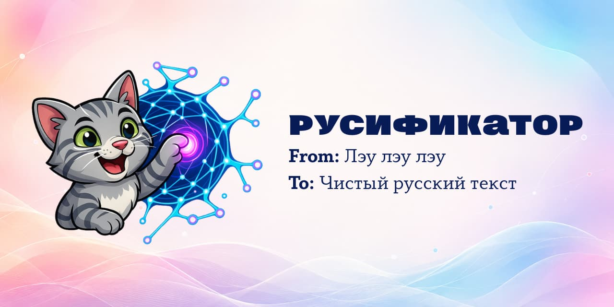

<p align="center">
  
</p>

<p align="center">
  Язык: <strong>Русский</strong> · <a href="README.en.md">English</a>
</p>

# Русификатор

[](https://github.com/xonika9/rusifikator-macos/releases/latest)
[](https://github.com/xonika9/rusifikator-macos/releases)
[](#установка)
[](LICENSE)

Утилита строки меню, которая превращает голосовую расшифровку в аккуратный русский текст. Надиктовал — вставил в поле — получил связный текст без оговорок, повторов и распознанных наугад слов.

- Живёт в строке меню и открывается одним щелчком; в Dock её нет.
- Каждая обработка изолирована: в запрос уходят только фиксированный системный промпт и текст, который сейчас в поле.
- Последние пять результатов лежат локально и никогда не попадают в новые запросы.
- Работает с любым OpenAI-совместимым провайдером по HTTPS; ключ хранится в Keychain.

> Полевые заметки об ИИ-моделях и инструментах разработчика я пишу в телеграм-канале [Контролируемые галлюцинации](https://t.me/+DOZWlhI4r4EyYjgy).

## Установка

Нужна macOS 26 или новее на Apple Silicon.

1. Скачай `Rusifikator-<версия>.dmg` со [страницы последнего релиза](https://github.com/xonika9/rusifikator-macos/releases/latest).
2. Открой образ и перетащи «Русификатор» в «Программы».
3. Запусти приложение. При первом запуске macOS откажется его открывать — это ожидаемо, см. ниже.

Приложение подписано локальной ad-hoc подписью, без сертификата Apple Developer ID. Поэтому первый запуск разблокируется вручную, один раз:

1. попробуй открыть приложение из «Программ»;
2. открой «Системные настройки → Конфиденциальность и безопасность»;
3. в разделе «Безопасность» нажми «Открыть всё равно» и подтверди паролем.

Дальше приложение запускается двойным щелчком, как любое другое. Подробности и границы этого ограничения — в разделе [«Подпись и Gatekeeper»](#подпись-и-gatekeeper).

## Как пользоваться

Значок появляется в строке меню. Левый щелчок открывает редактор, правый — меню с версией, настройками и выходом.

Перед первой обработкой зайди в настройки и введи ключ API, затем нажми «Сохранить». По умолчанию используется адрес `https://liteapi.gotacat.dev/`, модель `proxy/gpt-5.6-terra` и маршрут `POST /v1/chat/completions`; всё это меняется в настройках на любого другого OpenAI-совместимого провайдера.

Дальше цикл простой: вставить расшифровку, запустить обработку, скопировать результат. Кнопка «Проверить соединение» рядом с настройками отправляет короткий служебный текст и показывает, отвечает ли провайдер, — черновые значения из окна при этом не сохраняются.

Две привычки приложения, которые стоит знать заранее:

- **Один экземпляр на сеанс.** Повторный запуск выводит вперёд уже открытую копию и сразу завершается — второго значка в строке меню не появится.
- **Редактор сам убирается за собой.** Если окно было закрыто минуту и дольше, при следующем открытии поле чистое. История при этом не трогается, а начатая обработка не прерывается: она спокойно дописывается и попадает в историю.

## Обновления

В настройках есть действие «Проверить обновления»: рядом с ним видно, идёт ли проверка, установлена ли последняя версия, доступна ли новая или проверка не удалась. Раз в сутки приложение тихо смотрит канал само и не перебивает работу — окно обновления открывается только по явному нажатию.

Обновления устроены на [Sparkle](https://sparkle-project.org) — стандартном для macOS механизме обновления приложений вне App Store:

- метаданные и образ скачиваются только по HTTPS;
- образ проверяется подписью EdDSA до распаковки, изменённый файл не устанавливается;
- установку подтверждает владелец Mac, после чего приложение перезапускается;
- карантин с проверенного обновления снимается, поэтому разблокировку из раздела «Установка» повторять не нужно.

Обновиться нельзя, пока приложение запущено из смонтированного образа или из карантинной копии: сначала перенеси его в «Программы». В этом случае приложение прямо об этом и говорит.

## Приватность

- Адрес провайдера и модель хранятся в `UserDefaults`, ключ API — только в Keychain и с привязкой к HTTPS-origin провайдера. При смене провайдера ключ вводится заново.
- В запрос входят только системный промпт и текущий текст поля. Локальная история в запросы не добавляется никогда.
- Последние пять пар «исходник — результат» лежат в JSON-файле внутри `Application Support`. Историю можно целиком удалить из приложения; в аналитику и журналы она не уходит.
- Проверка обновлений обращается только к каналу обновлений и не передаёт туда ни текст, ни настройки, ни ключ API.
- Копирование происходит только по явному нажатию. После него текст лежит в системном буфере обмена и доступен его менеджерам, Universal Clipboard и другим приложениям.
- Текущую расшифровку получает провайдер. Его правила хранения и обработки данных находятся вне контроля приложения и оцениваются отдельно.

## Подпись и Gatekeeper

У проекта нет сертификата Apple Developer ID и нотарного заверения. Что из этого следует:

| | Как есть сейчас |
| --- | --- |
| Первый запуск | Gatekeeper блокирует ad-hoc подпись, разблокировка делается вручную один раз |
| Обновления | Проверяются подписью EdDSA; карантин снимается, повторная разблокировка не нужна |
| Что заменяет Developer ID | Приложение доверяет только образам, подписанным закрытым ключом владельца |
| Защиты macOS | Ничего не отключается: Gatekeeper, карантин и проверка подписей работают штатно |
| Архитектура | Сборка под Apple Silicon и помечена `arm64`; Mac на Intel обновление не получит |
| Ключ подписи | Пока нет Developer ID, сменить `SUPublicEDKey` через обновление нельзя |

Появление сертификата ничего не сломает у уже установленных копий; что именно тогда меняется, описано в [docs/RELEASING.md](docs/RELEASING.md).

## Сборка из исходников

Проект намеренно остаётся компактным Swift Package.

```sh
swift build
swift test
scripts/package-app.sh
scripts/smoke-test-app.sh dist/Rusifikator.app
```

Готовый пакет окажется в `dist/Rusifikator.app`. Подробности среды, работа в Xcode и правила изменений — в [CONTRIBUTING.md](CONTRIBUTING.md); процесс выпуска версий — в [docs/RELEASING.md](docs/RELEASING.md).

## Участие и безопасность

Отчёты об ошибках, воспроизводимые находки по совместимости и точечные улучшения приветствуются — начни с [CONTRIBUTING.md](CONTRIBUTING.md). Об уязвимостях сообщай по правилам из [SECURITY.md](SECURITY.md), а не публичной задачей. Общение — по [Кодексу поведения](CODE_OF_CONDUCT.md).

История версий — в [CHANGELOG.md](CHANGELOG.md).

## Лицензия

[MIT](LICENSE).
